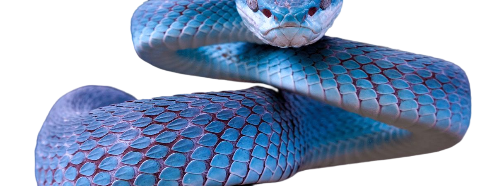

<h1></h1>

<h1 align="center"></h1>

| </a> | </a> |
| ---------------------------------------------------------------------------------------------------------------------------------------------------------------------------------------------------------------------------------------------------------- | ---------------------------------------------------------------------------------------------------------------------------------------------------------------------- |

 

<h1 align="center">Tecnologias Mais Usadas</h1>

 

 <h1 align="center">Redes Sociais</h1>
<!-- 

 -->

<a href = "mailto:robsonbrasil.emailparticular@gmail.com"></h1></a>
 

  

<b>Contador de Visitantes</b>
  

